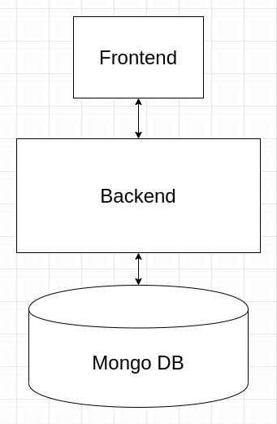

# Домашняя работа по курсу РВ

Реализованы четыре операции для объектов: 

- Создание предмета
- Чтение предмета по коду
- Чтение группы предметов по категории 
- Обновление предмета по коду
- Удаление предмета по коду.

Описание предмета

```
{
    "name": "laptop",
    "code": "42",
    "category": "device"
}
```



Коллекция с запросами postman находится в postman/items.postman_collection.json. 
Запуск:
``` docker-compose build && docker-compose up ```